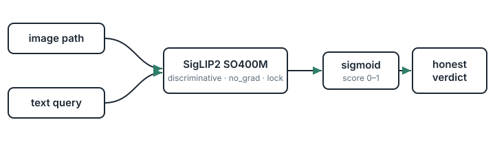

# Architecture

## Layers

- **`engine.py` — `SigLIPEngine`** (no MCP dependency; usable standalone). Lazy‑loads SigLIP2 and does the measurement: `score`, `score_multi`, `compare`, `embed_image`, `verify`, `selftest`. Forward passes are serialized by a per‑engine lock; queries over the 64‑token text limit are truncated (with a warning), not crashed.
- **`server.py` — FastMCP tools** wrap the engine, resolve paths, and map every failure to an actionable `ToolError` (missing path → check the path; invalid image; GPU OOM → try `AI_EYES_DTYPE=float16` / `AI_EYES_DEVICE=cpu`). STDIO transport; the raw error is logged at DEBUG, never leaked to the caller.
- **`__main__.py`** — the `python -m ai_eyes_mcp` entry point.

## Design decisions

- **Discriminative, not generative** — SigLIP2 returns a similarity score, not prose. No narrative to complete → no hallucination.
- **Sigmoid, not softmax** — each query is scored independently; several can be high at once.
- **Deterministic** — `torch.no_grad`, eval mode, no sampling. Same input → bit‑identical output (it's an instrument, not a storyteller).
- **Relative over absolute** — `image_verify` / `image_classify` rank candidates; they're robust to the query‑phrasing sensitivity that makes raw absolute thresholds fragile.
- **Honest ceiling** — a near‑zero score is a valid "not confidently present", surfaced as such rather than dressed up as certainty.
